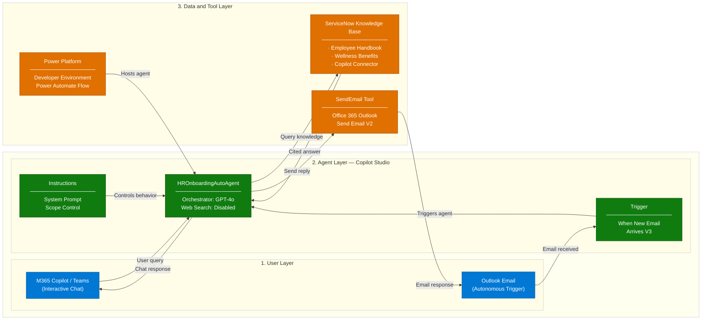
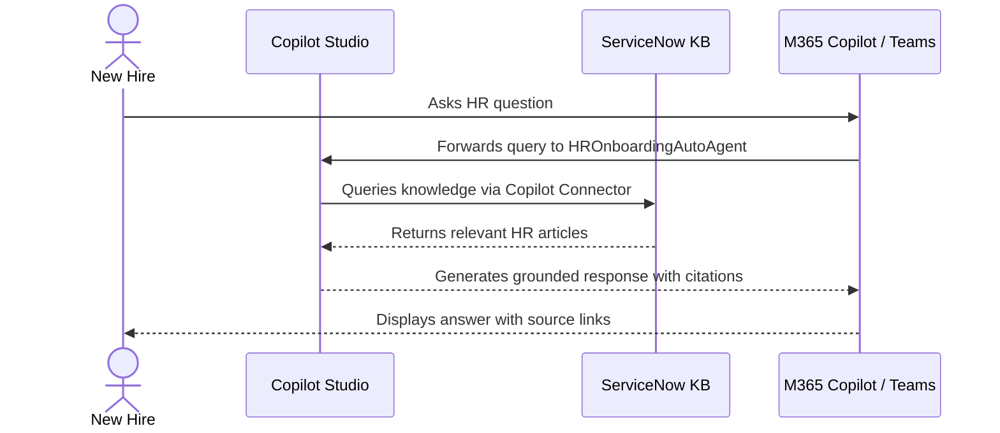
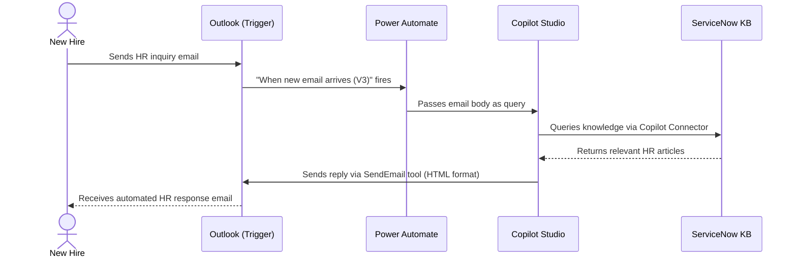

# HR Onboarding Autonomous Agent — Architecture

## 1. Logical Architecture

The HR Onboarding Agent operates across three layers: the **User Layer** (how users interact),
the **Agent Layer** (how the agent processes requests), and the **Data & Tool Layer**
(what the agent uses to generate responses).

### How It Works

---

## 2. Key Components

| Component | Technology | Role |
|---|---|---|
| **Agent Runtime** | Microsoft Copilot Studio | Core agent orchestration and response generation |
| **LLM / Orchestrator** | GPT-4o (default) | Natural language understanding and answer generation |
| **Knowledge Source** | ServiceNow Copilot Connector | Grounds agent responses in official HR documents |
| **Knowledge Articles** | ServiceNow Knowledge Base (IT) | Employee Handbook + Health & Wellness Benefits Guide |
| **Email Trigger** | When a new email arrives (V3) | Activates agent autonomously on incoming HR inquiry emails |
| **Email Tool** | Office 365 Outlook — Send Email V2 | Enables agent to send autonomous email replies |
| **Agent Environment** | Power Platform Developer Environment | Hosts agent artifacts and Dataverse |
| **Deployment Channels** | Microsoft Teams + M365 Copilot | Primary end-user access points for interactive chat |
| **Admin Portal** | Microsoft 365 Admin Center | Publishing, connector setup, and org-wide deployment |

---

## 3. Data Flow

### Scenario A — Interactive Chat (User-Initiated)

### Scenario B — Autonomous Email Response (Trigger-Initiated)

---

## 4. Security & Governance Considerations

| Area | Consideration |
|---|---|
| **Credentials** | Email trigger and SendEmail tool use the **maker's credentials** (author's connection) |
| **Data Scope** | Web Search is **disabled** — agent only responds from ServiceNow knowledge |
| **Knowledge Boundary** | If no answer is found, agent directs user to HR contact email instead of guessing |
| **Access Control** | M365 Admin approval required for org-wide deployment via Integrated Apps |
| **Connector Permissions** | ServiceNow Copilot Connector access scoped to authorized users only |
| **Content Safety** | GPT-4o content filters remain active; no custom model training involved |

---

## 5. Prerequisites & Licensing

| Requirement | Details | Where to Configure |
|---|---|---|
| Microsoft 365 Copilot License | Required per user for M365 Copilot channel access | M365 Admin Center |
| Power Platform Developer Environment | Free; must be non-default with Dataverse enabled | Power Platform Admin Center |
| ServiceNow Developer Tenant | Free developer instance for knowledge base setup | developer.servicenow.com |
| CDX Demo Tenant | Mandatory for demo/showcase setup | aka.ms/copilotdemotenant |
| Copilot Extensibility Enabled | Allow users access to Copilot agents | M365 Admin → Integrated Apps |
| Teams Custom App Side-loading | Required for Teams channel deployment | Teams Admin Center |

---

## Related Resources

| Resource | Link |
|---|---|
| Scenario Overview | ./1-Overview.md |
| Step-by-Step Runbook | ./3-Runbook.md |
| Sample Prompts | ./4-Sample-Prompts.md |
| Agent Instructions Template | ./Resources/agent-instructions.md |
| ServiceNow Connector Setup | SharePoint internal link |
| CDX Demo Tenant | https://aka.ms/copilotdemotenant |
